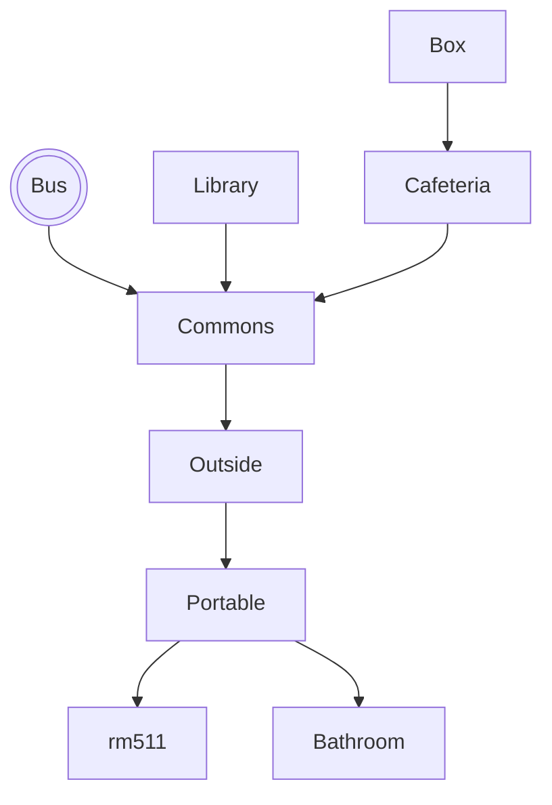

# School Journey

## Setting

This game takes place at home where you have to get ready for school, there are some random chance events that I have included which are: carpool, no e-scooter, walking, or bus stop, that provide different ways on how to arrive to school

## Map

The player at home and they must get ready to go to school
They can explore their surrondings and do activites, but must eventually make their way to Wakefield by 8:20
each actions takes a certain amount of minutes depending what type of action it is, like eating, getting dressed,
getting to school, and getting your stuff ready.

## Story

When the user wakes up they are at home and still in bed.
Its 7am and its probably too early to get up so you can snooze for an extra 7 minutes each time the alarm goes off, 
but be warned! Don't oversleep as some actions take most of your time like getting to school, eating breakfast and getting your backpack ready.

The game starts 1 hour and 20 minutes before the morning class bell, and each
move costs 1 minute while some actions take 5-10 minutes, like getting dressed or eating breakfast. So this journey must be completed by 8:20am.
Some moves like snoozing the alarm for extra sleep take up more minutes

## Global Variables

The most important variables are
`haveBackpack` and `ateBreakfast`, both
booleans that track progress in the
story. Depending on these two variables,
some rooms will display different things. For example, if you try
to leave home without either of these 2 varibles done beforehand, you would not be able to leave

I also have numeric variables called `day` and `minute` which keep track of 
time. `minute` starts at 0 and counts up
with each move.

I have a little HUD map, and use a bunch of 
boolean variables to control which
rooms the player has discovered. A map is only displayed after the user
visits it.