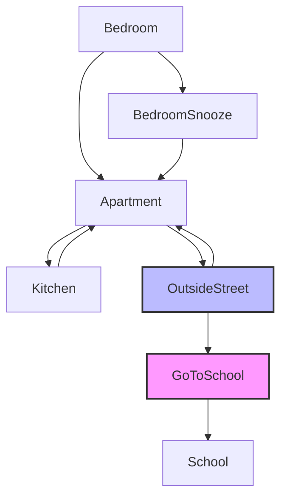

# School Journey

## Setting

This game takes place at home where you have to get ready for school. You start in your bedroom at 7:00 AM and must arrive at school by 8:20 AM. Along the way, you can prepare your backpack, eat breakfast, and get dressed. There are random transportation events (neighbor ride, bus, Lime Scooter) that can help you get to school faster, but you always have the option to walk.

## Map

**Legend:**
- **Blue nodes**: Locations where you must meet requirements (backpack, breakfast, dressed)
- **Pink nodes**: Time-critical decisions that can end the game if you're late

## Story

When you wake up in your bedroom at 7:00 AM, school starts at 8:20 AM. You can snooze the alarm for 7 more minutes each time, but be careful not to oversleep! You need to prepare your backpack, eat breakfast, and get dressed before you can leave for school.

From your bedroom, you can get up to go to the apartment, where you have access to the kitchen and the outside street. In the kitchen, you can eat breakfast or prepare your backpack. Back in the apartment, you can prepare your backpack if you haven't already, or head to the outside street once you're ready.

Once outside, you choose how to get to school. Walking takes 15 minutes but is always available. Random events may offer faster transportation options like a neighbor's ride (8 minutes), taking the bus (10 minutes), or using a Lime Scooter (5 minutes).

Each action takes time, so manage your morning carefully to arrive at school on time!

## Global Variables

The most important variables are:
- `BackpackReady`, `BreakfastAte`, `getDressed`: Booleans that track if you've completed the necessary preparations
- `currentTime`: Numeric variable tracking minutes since 7:00 AM (starts at 420, school deadline at 500)
- `gameActive`: Boolean controlling if the game is still running

Time advances with each action:
- Small actions: 2-5 minutes (moving between rooms, preparing backpack)
- Medium actions: 7-10 minutes (eating breakfast, getting dressed, transportation)
- Large actions: 15 minutes (walking to school)

The game ends if you arrive at school after 8:20 AM or if time runs out during any location.