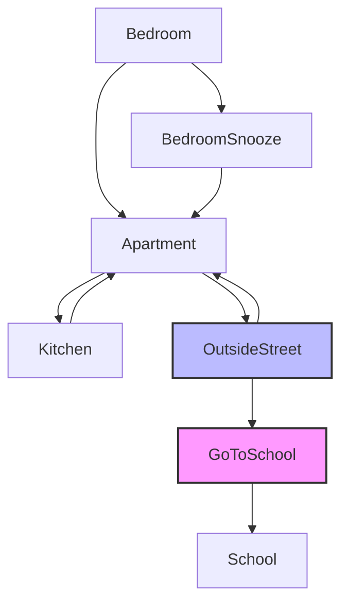

# School Journey

## Setting

This game takes place at home where you have to get ready for school. You start in your bedroom at 7:00 AM and must arrive at school by 8:20 AM. Along the way, there are requirements that have to be done before you are able to leave the home. There are random events that can help you get to school.

## Map

**Legend:**
- **Blue nodes**: Locations where you must meet requirements (backpack, breakfast, dressed)
- **Pink nodes**: Time measured based where the game ends if you dont complete the game on time

## Story

When you wake up in your bedroom at 7:00 AM, school starts at 8:20 AM. You can snooze the alarm for 7 more minutes each time, but be careful not to oversleep, you need to prepare your backpack, eat breakfast, and get dressed before you can leave for school.

From your bedroom, you can get up, where you are in the appartment and you have access to the kitchen and the outside street. In the kitchen, you can eat breakfast and you can prepare your backpack if you haven't already, or head to the outside street once you're ready once you are dressed

Once outside, you choose how to get to school. Walking takes 15 minutes but is always available. Random events may offer faster transportation options like a neighbor's ride (8 minutes), taking the bus (10 minutes), or using a Lime Scooter (5 minutes).

Each action takes time, so manage your morning carefully to arrive at school on time!

## Global Variables

The most important variables are:
- `BackpackReady`, `BreakfastAte`, `getDressed`: These are tracked if theres are completed or not to be able to leave
- `currentTime`: Variable tracking minutes since 7:00 AM (starts at 420, school deadline at 500)

Each actions take some amount of time, some take more than others while some take less than certain actions, its up to you to use your time wisely.

The game ends if you arrive at school after 8:20 AM or if time runs out during any location.